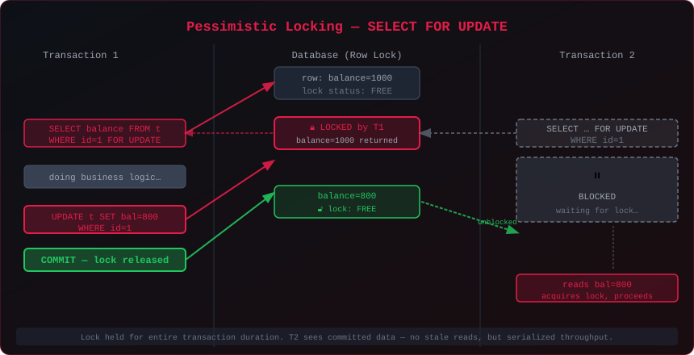
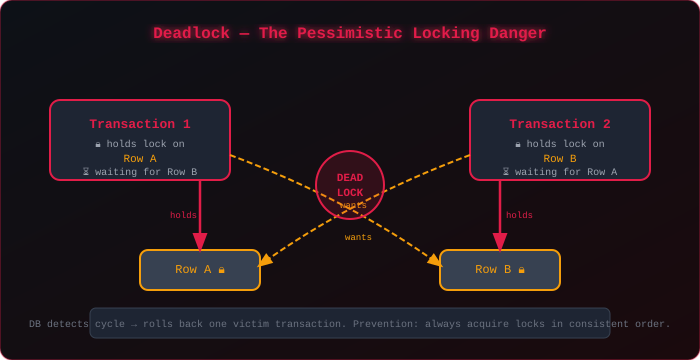
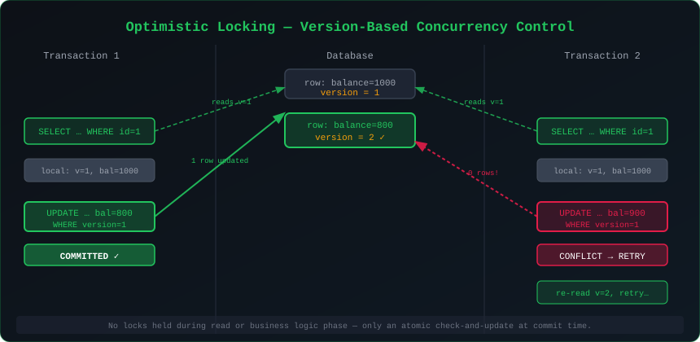
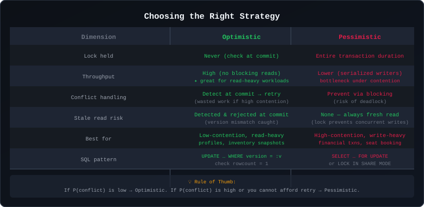

# Optimistic vs. Pessimistic Locking in Databases: A Deep Dive

Concurrency bugs are some of the hardest to reproduce and the most dangerous to ship. Two transactions reading the same row, computing a result, and writing back — that's all it takes for your bank balance to go negative or your airline to double-book a seat. The two fundamental strategies for preventing this are **optimistic locking** and **pessimistic locking**, and understanding when to use each is a core database engineering skill.

Having worked on high-concurrency PostgreSQL upgrade workflows at ServiceNow — where multiple automation agents race to acquire capacity across shared infrastructure — I've had to reason carefully about these tradeoffs. Here's a structured breakdown.

---

## The Root Problem: Lost Updates

Before choosing a locking strategy, it's worth naming the exact problem we're solving: the **lost update anomaly**.

```
Time  T1                           T2
----  ----                         ----
t1    READ balance = 1000
t2                                 READ balance = 1000
t3    balance = 1000 - 200 = 800
t4    WRITE balance = 800
t5                                 balance = 1000 - 100 = 900
t6                                 WRITE balance = 900   ← T1's debit LOST
```

T2 overwrites T1's committed update because it started with stale data. The final balance is `900` instead of the correct `700`. This is a lost update, and it happens in any isolation level below **Repeatable Read** in most databases.

Both locking strategies prevent this — but through opposite philosophies.

---

## Pessimistic Locking

**Philosophy:** Assume conflicts *will* happen. Acquire the lock before you even read the data.

The canonical SQL construct is `SELECT ... FOR UPDATE`, which places an **exclusive row-level lock** on every row returned by the query.

```sql
BEGIN;

SELECT balance
FROM accounts
WHERE id = 42
FOR UPDATE;   -- acquires exclusive lock immediately

-- business logic here: balance = balance - 200

UPDATE accounts SET balance = 800 WHERE id = 42;

COMMIT;       -- lock released
```

Any other transaction that issues `SELECT ... FOR UPDATE` or `UPDATE` on row `id=42` will **block** until T1 commits or rolls back.



### How the lock escalates

| SQL Clause | Lock Type | Blocks |
|---|---|---|
| `SELECT ... FOR UPDATE` | Exclusive | All readers (FOR SHARE/FOR UPDATE) and all writers |
| `SELECT ... FOR SHARE` | Shared | Writers only; other readers allowed |
| `UPDATE / DELETE` | Exclusive | All |
| Plain `SELECT` | None | Not blocked by anything |

PostgreSQL's MVCC means plain `SELECT` never blocks — it reads a snapshot. Only the locking variants block.

### The Deadlock Risk

When two transactions each hold a lock the other wants, the database detects the cycle and rolls back one of them (the "victim").



**Prevention:** Always acquire locks in a consistent global order. If T1 always locks `Row A` before `Row B`, T2 must do the same. This eliminates the circular dependency.

```sql
-- Both transactions lock in ascending id order
SELECT * FROM accounts WHERE id IN (10, 42) ORDER BY id FOR UPDATE;
```

---

## Optimistic Locking

**Philosophy:** Assume conflicts are *rare*. Read freely, detect conflicts at commit time.

No database-level lock is held. Instead, a **version column** (or timestamp) is used to detect concurrent modifications:

```sql
-- Schema: add a version column
ALTER TABLE accounts ADD COLUMN version INT DEFAULT 1;
```

**Read phase** — no locking:
```sql
SELECT id, balance, version FROM accounts WHERE id = 42;
-- returns: id=42, balance=1000, version=1
```

**Write phase** — atomic check-and-update:
```sql
UPDATE accounts
SET balance = 800,
    version = version + 1
WHERE id = 42
  AND version = 1;   -- the key: only update if version hasn't changed
```

Check the row count returned:
- `1 row updated` → success, you committed cleanly.
- `0 rows updated` → conflict detected. Another writer changed the row. **Retry** by re-reading and recomputing.



### Hibernate / JPA annotation

ORMs make this pattern first-class:

```java
@Entity
public class Account {
    @Id
    private Long id;

    private BigDecimal balance;

    @Version           // Hibernate manages this automatically
    private Integer version;
}
```

Hibernate generates the `WHERE version = ?` clause and throws `OptimisticLockException` on conflict — which your service layer catches and retries.

### Using timestamps instead of integer versions

```sql
ALTER TABLE accounts ADD COLUMN updated_at TIMESTAMP DEFAULT now();

UPDATE accounts
SET balance = 800,
    updated_at = now()
WHERE id = 42
  AND updated_at = '2026-09-03 10:00:00.123';
```

Be cautious with timestamps on high-throughput systems: clock skew and sub-millisecond resolution can cause false conflicts or missed detections. **Integer versions are safer.**

---

## Comparison: When to Use Each



### Use Optimistic Locking when:

- **Read-to-write ratio is high** — most transactions just read. Holding locks during all those reads is wasteful overhead.
- **Contention is low** — actual concurrent writes to the same row are rare in practice.
- **Retry is cheap** — your business logic is idempotent and re-executing from scratch is fast.
- **You want maximum read scalability** — analytics, reporting, profile reads, inventory snapshots.

Real-world examples: user profile updates, blog post edits, product catalog updates, non-financial configuration changes.

### Use Pessimistic Locking when:

- **Contention is high** — multiple writers genuinely compete for the same rows frequently.
- **Retry is expensive** — the business logic is long-running (calling external APIs, sending emails) and you cannot afford to redo it after a conflict.
- **Correctness over throughput** — financial transactions, seat/ticket booking, inventory decrement at checkout.
- **You need to prevent phantom reads** — `SELECT ... FOR UPDATE` combined with `SERIALIZABLE` isolation prevents gaps.

Real-world examples: concert ticket reservation, hotel room booking, bank transfers, stock trading order matching.

---

## Advanced Patterns

### Conditional Updates (Optimistic, No Version Column)

Sometimes you don't have a version column, but you can use the data itself as the guard condition:

```sql
-- Only deduct if balance is sufficient AND hasn't changed
UPDATE accounts
SET balance = balance - 200
WHERE id = 42
  AND balance >= 200
  AND balance = 1000;  -- guard: the value we read
```

This is fragile — a coincidental identical balance after a round-trip update would succeed incorrectly. Prefer explicit version columns.

### Advisory Locks (PostgreSQL-specific)

For coarser-grained coordination (e.g., preventing two automation jobs from running the same workflow), PostgreSQL offers **advisory locks** — application-managed, not tied to a row:

```sql
-- Session-level advisory lock (held until released or session ends)
SELECT pg_try_advisory_lock(12345);   -- returns true if acquired, false if busy

-- Transaction-level advisory lock (released on COMMIT/ROLLBACK)
SELECT pg_try_advisory_xact_lock(12345);
```

I used this pattern in ServiceNow's PUP (PostgreSQL Upgrade Process) to prevent duplicate upgrade workflows from launching for the same instance simultaneously.

### Snapshot Isolation vs. Serializable Isolation

| Isolation Level | Lost Updates | Phantom Reads | Write Skew | Performance |
|---|---|---|---|---|
| Read Committed | Possible | Possible | Possible | Fastest |
| Repeatable Read | Prevented (PG) | Possible | Possible | Moderate |
| Serializable | Prevented | Prevented | Prevented | Slowest |

PostgreSQL's `SERIALIZABLE` uses **Serializable Snapshot Isolation (SSI)** — it detects dangerous read-write dependencies and aborts one transaction rather than blocking. It's closer to optimistic locking at the isolation level, with automatic conflict detection.

```sql
SET TRANSACTION ISOLATION LEVEL SERIALIZABLE;
```

---

## Lessons from Production

Working on PostgreSQL upgrade automation at ServiceNow, several capacity-management workflows ran concurrently for different instances. The core issue: two workflows could both see "available capacity = 5 slots," each decide they could consume a slot, and both commit — oversubscribing the system.

**The fix we used:** Pessimistic locking on the capacity record:

```sql
BEGIN;
SELECT available_slots
FROM capacity_pool
WHERE pool_id = :pool_id
FOR UPDATE;  -- blocks other agents

-- if available_slots > 0: decrement and proceed
UPDATE capacity_pool
SET available_slots = available_slots - 1
WHERE pool_id = :pool_id;

COMMIT;
```

We chose pessimistic here because:
1. **Contention was real** — many upgrade workflows genuinely competed for limited slots.
2. **Retry would have re-triggered the entire workflow** — very expensive.
3. **Lock duration was short** — the capacity check and decrement took microseconds, not seconds. Brief locks are fine.

Had contention been rare and retries cheap, optimistic with a version column would have been the cleaner choice.

---

## The Hybrid Approach

Real systems often use both:

- **Outer layer:** Pessimistic lock on a coarse-grained resource (e.g., the capacity pool record) — short critical section, high correctness requirement.
- **Inner layer:** Optimistic locking on per-row updates (e.g., individual account records) — high read throughput, retries are cheap.

```
Workflow enters critical section
    → SELECT capacity_pool FOR UPDATE   (pessimistic, short)
        → Determine eligible slot
    → COMMIT (release pool lock)

Application logic proceeds
    → SELECT account WHERE id=X         (no lock)
    → Compute new balance
    → UPDATE … WHERE version = :v       (optimistic commit)
    → On conflict: retry inner loop only
```

This minimizes lock contention while protecting the invariants that truly require serialization.

---

## Conclusion

Both strategies prevent the same class of concurrency bugs; they differ in *when* conflict detection happens and what the cost of that detection is.

- **Optimistic** detects late, retries on failure — excellent throughput when conflicts are rare.
- **Pessimistic** detects early by blocking — consistent correctness when conflicts are frequent or retries are prohibitively expensive.

The mistake most engineers make is defaulting to pessimistic locking everywhere "to be safe" — and discovering throughput problems at scale. The inverse mistake is using optimistic locking in a high-contention system where the retry rate exceeds 30–40%, turning the system into a spin-loop.

Measure your actual contention rate. Choose the strategy that minimizes wasted work for your specific workload. And never share a mutable row across unrelated business transactions — design your schema to contain concurrency at natural boundaries.
